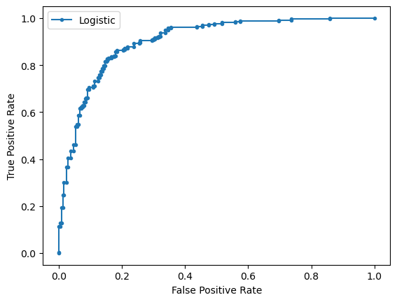
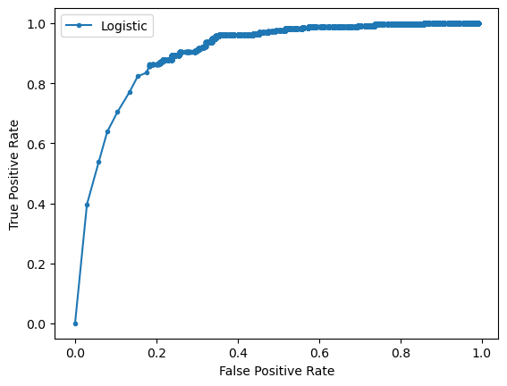

## HOMEWORK: think of example when all metrics are high, but model is bad

we need to also think about negative predictive value = tn/(tn+fn)

High precision and high recall are enough for other metrics to be high unless number of samples in classes are very inbalanced 

if classes are inbalanced we need to check each metric

An example where all metrics mentioned above are high but model is not good at predicting negative values(npv is low)

samples - 1050, number of positives - 1000, number of negatives - 50

tp = 950, tn = 40, accuracy = 990/1050 ~ 0.95, fp = 10,

SPECIFICITY = 4/5 = 0.8 # high specificity tells that fp(negatives that were predicted positive) are a small portion(0.2) of all negatives but this small portion may be considerable compared to true positives which will cause low positive predictive value(precision = tp/tp+fp)

PRECISION(ppv) = 950/960 ~ 1 # so fp is small compared to tp too

fn = 50

RECALL(sensitivity) = 950/1000 = 0.95 # high recall tells that fn(positives that were predicted negative) are very small portion(0.05) of all positives but this small portion can be considerable compared to true negatives which will cause low negative predictive value(npv) = tn/(tn+fn) = 40/90 = 0.45

F1_score = 950/(950+(50+40)/2) = 0.95

# ROC Curve, AUC


```python
from sklearn.datasets import make_classification
from sklearn.linear_model import LogisticRegression
from sklearn.model_selection import train_test_split
from sklearn.metrics import roc_curve
from sklearn.metrics import roc_auc_score
from matplotlib import pyplot as plt
```

Generating 2 class dataset


```python
X, y = make_classification(n_samples=1000, n_classes=2, random_state=1)
# split into train/test sets
trainX, testX, trainy, testy = train_test_split(X, y, test_size=0.5, random_state=2)
```

Fitting a model


```python
model = LogisticRegression(solver='lbfgs')
model.fit(trainX, trainy)
```

    0.834
    

Predicting probabilities


```python
lr_probs = model.predict_proba(testX)
```

Keeping probabilities for the positive outcome only


```python
lr_probs = lr_probs[:, 1]
```

Calculating score


```python
lr_auc = roc_auc_score(testy, lr_probs)
print('Logistic: ROC AUC=%.5f' % (lr_auc))
```

    Logistic: ROC AUC=0.90282
    

Plotting roc curve


```python
lr_fpr, lr_tpr, _ = roc_curve(testy, lr_probs)
# plot the roc curve for the model
plt.plot(lr_fpr, lr_tpr, marker='.', label='Logistic')
# axis labels
plt.xlabel('False Positive Rate')
plt.ylabel('True Positive Rate')
# show the legend
plt.legend()
# show the plot
plt.show()
```


    

    


# Implementing roc_auc_score and roc_curve functions on our own


```python
import numpy as np
def roc_curve1(testy, probs):
    def f(test, pred):
        tp = sum(test[test==pred]==1)
        tn = sum(test[test==pred]==0)        
        fp = sum(test[test!=pred]==0)
        fn = sum(test[test!=pred]==1)
        return tp, fp, tn, fn
    p = 1
    fpr, tpr, thresh = [], [], []
    count=0
    while p >= 0.0001:
        pred = probs > p
        tp, fp, tn, fn = f(testy, pred)
        fpr.append(fp/(tn+fp))   
        tpr.append(tp/(tp+fn))
        thresh.append(p)
        count+=1
        # np.linspace(1, 0, 100)
        if p < 0.5:
            p /= 1.001
        else:
            p /= 1.1
    return fpr, tpr, thresh
def roc_auc_score1(testy, lr_probs):
    fpr, tpr, _ = roc_curve1(testy, lr_probs)
    area = 0
    for i in range(1, len(fpr)):
        area += (fpr[i]-fpr[i-1])*(tpr[i] + tpr[i-1])/2
    return area + 1-fpr[-1]
```


```python
lr_fpr, lr_tpr, _ = roc_curve1(testy, lr_probs)
plt.plot(lr_fpr, lr_tpr, marker='.', label='Logistic')
plt.xlabel('False Positive Rate')
plt.ylabel('True Positive Rate')
plt.legend()
plt.show()
print(roc_auc_score1(testy, lr_probs))
```


    

    


    0.9020032051282039
    


```python

```
