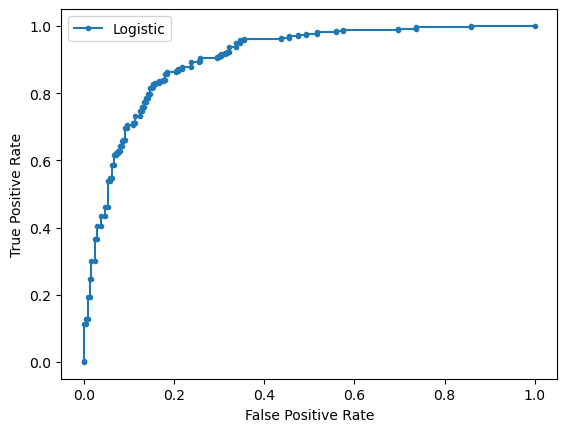
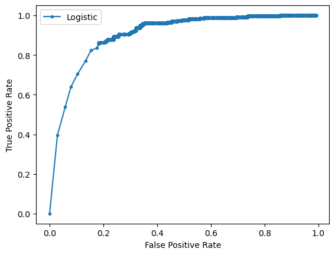

# ROC(Receiver Operating Characteristic) Curve, AUC(Area Under the Curve)
## Implementing with sklearn
**Importing**
```python
from sklearn.datasets import make_classification
from sklearn.linear_model import LogisticRegression
from sklearn.model_selection import train_test_split
from sklearn.metrics import roc_curve
from sklearn.metrics import roc_auc_score
from matplotlib import pyplot as plt
```
**Generating 2 class dataset**
```python
X, y = make_classification(n_samples=1000, n_classes=2, random_state=1)
# split into train/test sets
trainX, testX, trainy, testy = train_test_split(X, y, test_size=0.5, random_state=2)
```
**Fitting a model**
```python
model = LogisticRegression(solver='lbfgs')
model.fit(trainX, trainy)
```
**Predicting probabilities**
```python
lr_probs = model.predict_proba(testX)
```
**Keeping probabilities for the positive outcome only**
```python
lr_probs = lr_probs[:, 1]
```
**Calculating score**
```python
lr_auc = roc_auc_score(testy, lr_probs)
print('Logistic: ROC AUC=%.5f' % (lr_auc))
```
**Output**
```
Logistic: ROC AUC=0.90282
```
**Plotting roc curve**
```python
lr_fpr, lr_tpr, _ = roc_curve(testy, lr_probs)
# plot the roc curve for the model
plt.plot(lr_fpr, lr_tpr, marker='.', label='Logistic')
# axis labels
plt.xlabel('False Positive Rate')
plt.ylabel('True Positive Rate')
# show the legend
plt.legend()
# show the plot
plt.show()
```
**Output**  


## Implementing on our own
```python
import numpy as np
def roc_curve1(testy, probs):
    def f(test, pred):
        tp = sum(test[test==pred]==1)
        tn = sum(test[test==pred]==0)        
        fp = sum(test[test!=pred]==0)
        fn = sum(test[test!=pred]==1)
        return tp, fp, tn, fn
    p = 1
    fpr, tpr, thresh = [], [], []
    count=0
    while p >= 0.0001:
        pred = probs > p
        tp, fp, tn, fn = f(testy, pred)
        fpr.append(fp/(tn+fp))   
        tpr.append(tp/(tp+fn))
        thresh.append(p)
        count+=1
        # np.linspace(1, 0, 100)
        if p < 0.5:
            p /= 1.001
        else:
            p /= 1.1
    return fpr, tpr, thresh
def roc_auc_score1(testy, lr_probs):
    fpr, tpr, _ = roc_curve1(testy, lr_probs)
    area = 0
    for i in range(1, len(fpr)):
        area += (fpr[i]-fpr[i-1])*(tpr[i] + tpr[i-1])/2
    return area + 1-fpr[-1]
```


```python
lr_fpr, lr_tpr, _ = roc_curve1(testy, lr_probs)
plt.plot(lr_fpr, lr_tpr, marker='.', label='Logistic')
plt.xlabel('False Positive Rate')
plt.ylabel('True Positive Rate')
plt.legend()
plt.show()
print(roc_auc_score1(testy, lr_probs))
```
**Output**


    
0.9020032051282039
